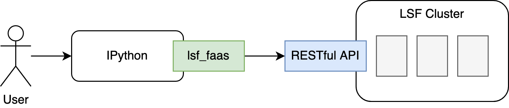

# LSF Python Function as a Service Package
This package is designed to invoke function calls (especially for time-consuming functions) via LSF as jobs without blocking current interactive shell.

<p align="center"></p>

## Precondition
1. server side  
   An on premise cluster with both `IBM Spectrum LSF` and `IBM Spectrum Application Center` deployed. Python3 should work on cluster managed hosts.
2. client side  
   A user client to use `IBM Spectrum LSF` Python function service. Python3 and IPython are deployed.

`lsf_faas` package uses below modules:
  - `dill`
  - `httplib2`

You should install them in your Python environment.

**Note**: all Python modules used in your Python context should be consistent across server and client.

## Deployment
### Installation
Clone or download this repo and navigate to the repo root directory. Install the package by `setup.py` script and then use it on demand by running 'import' in your Python context.
```bash
sudo python3 setup.py install
```
```python
In [1]:from lsf_faas import lsf
```
Please import `lsf_faas` module first of all to make sure it works as expected.

## Usage
Help message is dispalyed in Python by calling `help`.
```python
[user@test ~]# ipython
...
In [1]: help(lsf)
..
```

### Example
Here is a `K-means` clustering algorithm as a simple example.

```python
[user@test ~]# ipython
...
# logon to LSF with your information
In [2]: lsf.logon(username=username, password=password, host=host, port=port, isHttps=False)
Out[2]: True

In [3]: import matplotlib.pyplot as plt
In [4]: import numpy as np
In [5]: from sklearn.cluster import KMeans
In [6]: from sklearn.datasets import load_iris

In [7]: iris = load_iris()
In [8]: data = iris.data[:]

In [9]:  plt.scatter(data[:, 0], data[:, 1], c = "green", marker='o', label='label')
In [10]: plt.xlabel('petal-length')
In [11]: plt.ylabel('petal-width')
In [12]: plt.legend(loc=4)
In [13]: plt.show()

In [14]: def myfun(arg):
    ...:     estimator = KMeans(n_clusters=3)
    ...:     estimator.fit(arg)
    ...:     label_pred = estimator.labels_
    ...:     return arg[label_pred == 0], arg[label_pred == 1],arg[label_pred == 2]
    ...:

# submit the function to LSF
In [15]: id = lsf.sub(myfun, data)

# get result from LSF,
In [16]: x0,x1,x2 = lsf.get(id)

In [17]: plt.scatter(x0[:, 0], x0[:, 1], c = "green", marker='o', label='label1')
In [18]: plt.scatter(x1[:, 0], x1[:, 1], c = "red", marker='*', label='label2')
In [19]: plt.scatter(x2[:, 0], x2[:, 1], c = "blue", marker='+', label='label3')
In [20]: plt.xlabel('petal-length')
In [21]: plt.ylabel('petal-width')
In [22]: plt.legend(loc=4)
In [23]: plt.show()

# logout
In [24]:lsf.logout()

In [25]:
```

### Functions
For the API documentation, please refer to [API references](docs/api.md) for details.

Or, you can use Python `help` function to get the documentation.
- session management
  - `lsf.logon()`
  - `lsf.logout()`
- execution management
  - `lsf.sub()`
  - `lsf.exe()`
  - `lsf.get()`
  - `lsf.cancel()`
- file management
  - `lsf.download()`

## Notice
Currently, only modules start with "import" or "from" can be managed by `lsf_faas` automatically. If your Python function uses other way to `import` a module, the function cannot be executed successfully in `IBM Spectrum LSF`.

For example:
```python
In [1]: from A import B
In [2]: import A
# module C should not be used in your Python function which will be submit to LSF
In [3]: time.sleep(5); import C
```

